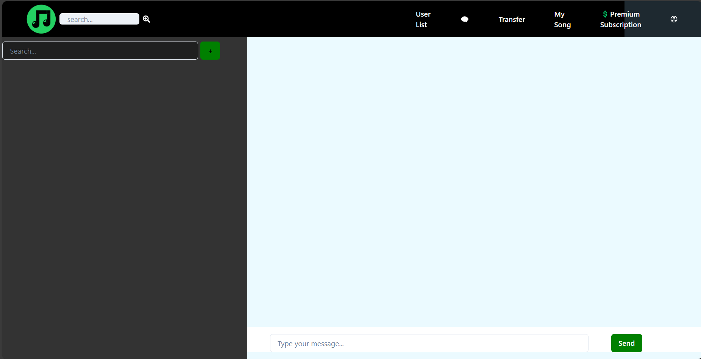
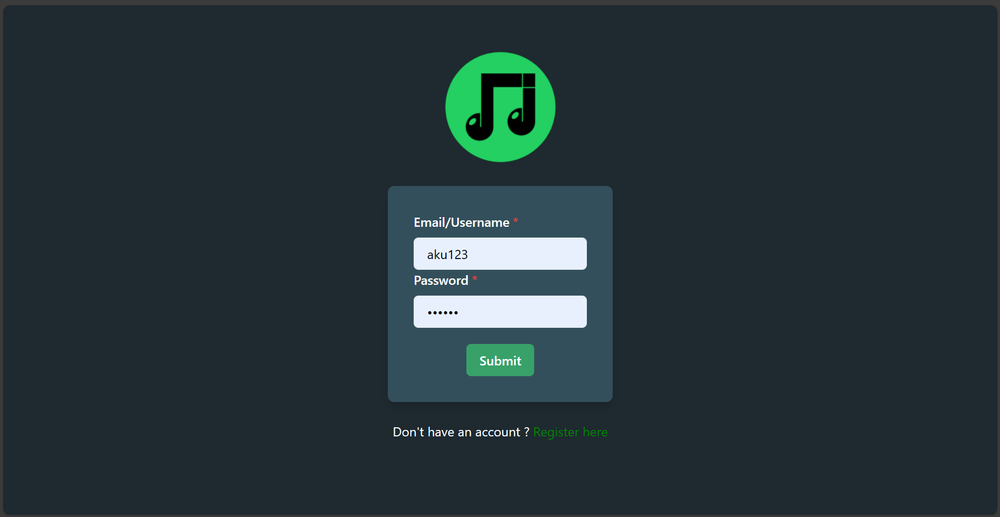
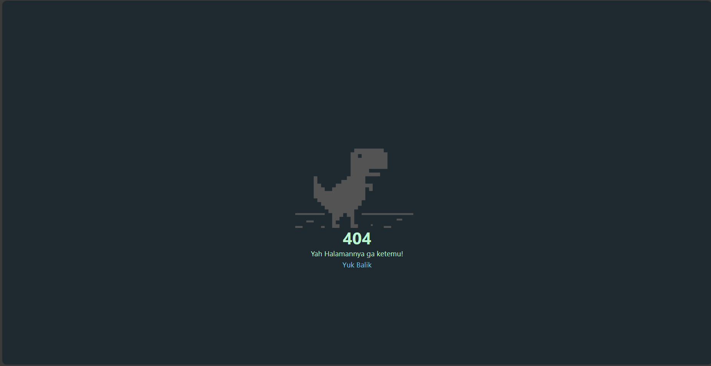
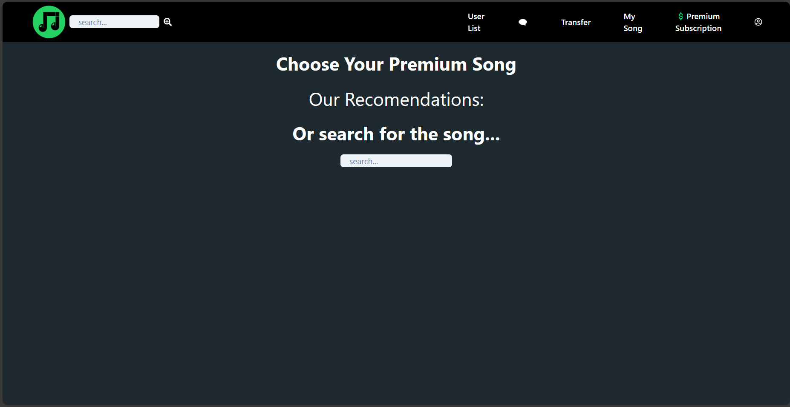
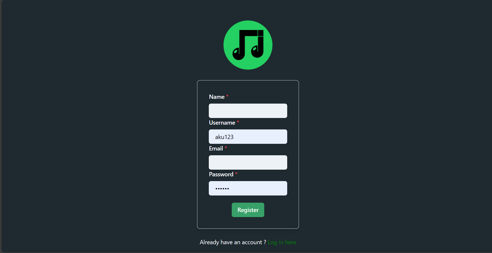
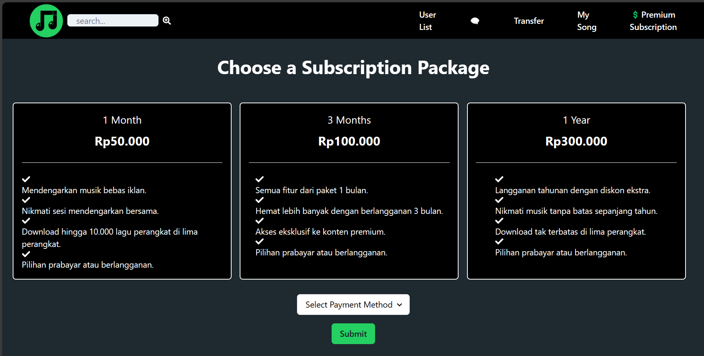
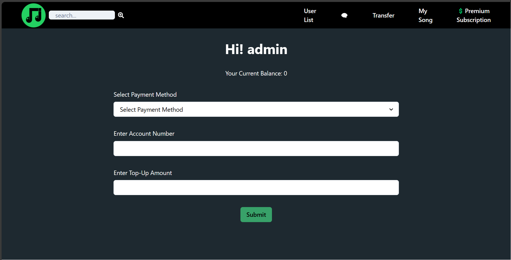
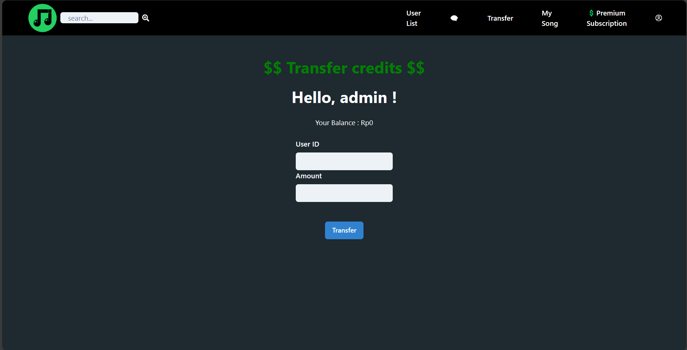
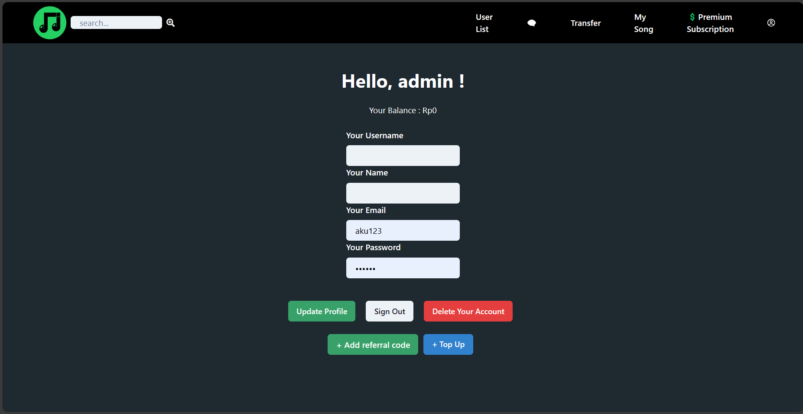
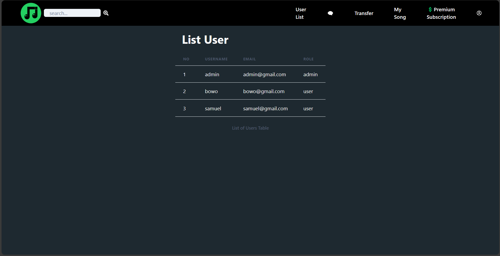

# Spotyphie - SOAP Service

> Disusun untuk memenuhi Tugas Milestone 2 - SOAP & RestFUL SPA Web Service - IF3110 Pengembangan Aplikasi Berbasis Web

## Daftar Isi

-   [Deskripsi _Web Service_](#deskripsi-web-service)
-   [Struktur Program](#struktur-program)
-   [Daftar _Requirement_](#daftar-requirement)
-   [Daftar _Fitur_](#daftar-fitur)
-   [Cara Instalasi](#cara-instalasi)
-   [Cara Menjalankan _Server_](#cara-menjalankan-server)
-   [Screenshot Tampilan Aplikasi](#screenshot-tampilan-aplikasi)
-   [Pembagian Tugas](#pembagian-tugas)

## Deskripsi _Web Service_

**Spotyphie** Single Page Application merupakan jenis aplikasi web yang dirancang untuk memberikan pengalaman pengguna yang responsif dan dinamis tanpa perlu me-refresh halaman. SPA memanfaatkan teknologi seperti JavaScript, HTML, dan CSS untuk memuat konten secara asinkron, memungkinkan navigasi yang mulus dan cepat di dalam satu halaman. Dengan meminimalkan waktu pemuatan, SPA menciptakan antarmuka pengguna yang interaktif dan efisien, menghadirkan pengalaman browsing yang mirip dengan aplikasi desktop. SPA juga memfasilitasi pengelolaan state secara efektif, memberikan performa tinggi dan memungkinkan pengembang untuk fokus pada pengembangan fitur tanpa terlalu bergantung pada server untuk setiap tindakan pengguna.

## Struktur Program

```
┗ .vscode
┃   ┗ settings.json
┣ node _modules
┣ public
┃    ┣ logo_spotyphie.png
┃    ┗ vite.svg
┣ src
┃    ┣ assets
┃    ┃ ┣ logo_spotyphie.png
┃    ┃ ┗ react.svg
┃    ┣ auth
┃    ┃ ┣ cookie.ts
┃    ┃ ┗ user.ts
┃    ┣ components
┃    ┃ ┗ Navbar
┃    ┃   ┣ Navbar.tsx
┃    ┃   ┗ SongsButton.tsx
┃    ┣ config
┃    ┃ ┗ configs.ts
┃    ┣ pages
┃    ┃ ┣ Add Playlist
┃    ┃ ┃ ┗ AddPlaylist.tsx
┃    ┃ ┣ Add Song
┃    ┃ ┃ ┗ AddSong.tsx
┃    ┃ ┣ Chat
┃    ┃ ┃ ┗ ChatPage.tsx
┃    ┃ ┣ Login
┃    ┃ ┃ ┗ Login.tsx
┃    ┃ ┣ Main
┃    ┃ ┃ ┗ Main.tsx
┃    ┃ ┣ My Song
┃    ┃ ┃ ┗ MySong.tsx
┃    ┃ ┣ NotFound
┃    ┃ ┃ ┗ NotFound.tsx
┃    ┃ ┣ Playlist
┃    ┃ ┣ Referral
┃    ┃ ┃ ┗ Referral.tsx
┃    ┃ ┣ Register
┃    ┃ ┃ ┗ Register.tsx
┃    ┃ ┣ Search
┃    ┃ ┃ ┗ Search.tsx
┃    ┃ ┣ Song
┃    ┃ ┃ ┗ Song.tsx
┃    ┃ ┣ Subscription
┃    ┃ ┃ ┗ Subscription.tsx
┃    ┃ ┣ Top Up
┃    ┃ ┃ ┗ TopUp.tsx
┃    ┃ ┣ Transfer
┃    ┃ ┃ ┗ Transfer.tsx
┃    ┃ ┣ User
┃    ┃ ┃ ┗ User.tsx
┃    ┃ ┗ UserList
┃    ┃ ┃ ┗ UserList.tsx
┃    ┣ utils
┃    ┃ ┗ UserType.ts
┃    ┣ App.css
┃    ┣ App.tsx
┃    ┣ index.css
┃    ┣ main.tsx
┃    ┣ Router.tsx
┃    ┗ vite-env.d.ts
┣ .dockerignone
┣ .dockerignore
┣ .env
┣ .eslintrc.cjs
┣ .gitignore
┣ docker-compose.yaml
┣ index.html
┣ package-lock.json
┣ package.json
┣ README.md
┣ tsconfig.jason
┣ ts.config.node.json
┗ vite.config.ts
```

## Daftar _Requirement_
1. Docker desktop

## Daftar _Fitur_

1. Add Playlist
2. Add Song
3. Chat
4. Login
5. Main
6. My Song
7. Not Found
8. Playlist
9. Referral
10. Register
11. Search
12. Song
13. Subscription
14. Top Up
15. Transfer
16. User
17. UserList

## Cara Instalasi

1. Lakukan pengunduhan _repository_ ini dengan menggunakan perintah `git clone https://gitlab.informatika.org/if3110-2023-02-23/spotyphie-client.git` pada terminal komputer Anda.
2. Pastikan komputer Anda telah menginstalasi dan menjalankan aplikasi Docker.
3. Lakukan pembuatan _image_ Docker yang akan digunakan oleh aplikasi ini dengan menjalankan perintah `docker .` pada terminal _directory_ aplikasi web.
4. Buatlah sebuah file `.env` yang bersesuaian dengan penggunaan (contoh file tersebut dapat dilihat pada `.env.example`).

## Cara Menjalankan _Server_

0. **Pastikan Spotyphie _monolith service_ telah berjalan**
1. Anda dapat menjalankan program ini dengan menjalankan perintah `docker-compose up --build -d` pada terminal _directory_ Client Service untuk pertama kali (untuk kedua kali cukup hanya dengan perintah `docker-compose up -d`).
2. Client Service berjalan pada pada URL `http://localhost:{SPOTYPHIE_CLIENT_PORT}/`.
3. Client Service dapat dihentikan dengan menjalankan perintah perintah `docker-compose down` pada terminal _directory_ REST Service.

**Cara Lain**
1. Masukan perintah `npm start` pada terminal _directory_ Client Service
2. Tekan link Local: http://localhost:3000/
3. Dapat dihentikan dengan menekan tombol ctrl+C

## Screenshot Tampilan Aplikasi

### Add Playlist


### Add Song


### Chat



### Login



### Main


### My Song


### Not Found



### Playlist


### Referral



### Register



### Search


### Song


### Subscription



### Top Up



### Transfer



### User



### User List



## Pembagian Tugas

### Major Feature

|feature|13521125|13521131|13521172|
|-------|--------|--------|--------|
|Add Playlist|||:heavy_check_mark:|
|Add Song|:heavy_check_mark:|||
|Chat|:heavy_check_mark:|:heavy_check_mark:||
|Login|||:heavy_check_mark:|
|Main|||:heavy_check_mark:|
|My Song|||:heavy_check_mark:|
|Not Found||:heavy_check_mark:||
|Playlist|:heavy_check_mark:|||
|Referral||:heavy_check_mark:||
|Register|:heavy_check_mark:|||
|Search||:heavy_check_mark:||
|Song|||:heavy_check_mark:|
|Subscription|:heavy_check_mark:||:heavy_check_mark:|
|Top Up|:heavy_check_mark:||:heavy_check_mark:|
|Transfer||:heavy_check_mark:||
|User||:heavy_check_mark:||
|UserList||:heavy_check_mark:||

### Extras

|feature|13521125|13521131|13521172|
|-------|--------|--------|--------|

