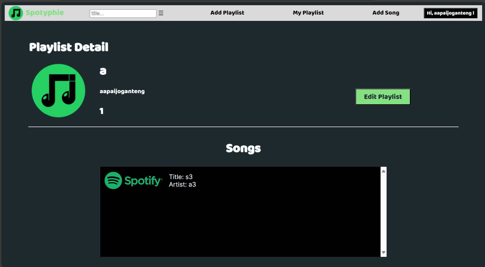
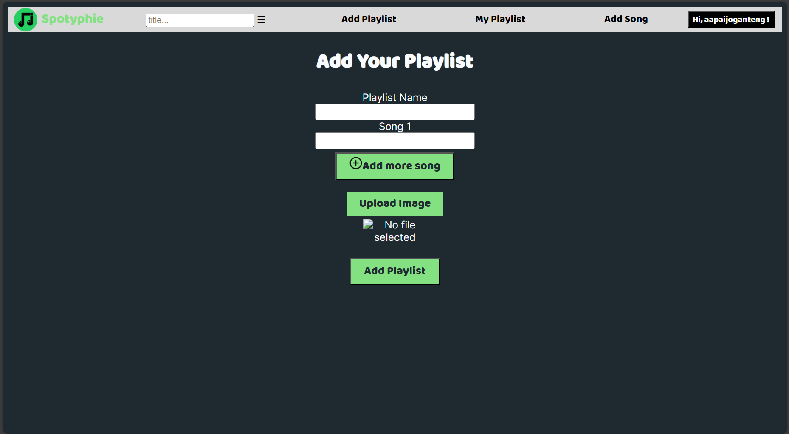

# Spotyphie-Monolith Service

> Disusun untuk memenuhi 
> - Tugas Milestone 1 - Monolithic PHP & Vanilla Web Application
> - Tugas Milestone 2 - SOAP & Restful SPA Web Service
>
> IF3110 Pengembangan Aplikasi Berbasis Web

## Daftar Isi

-   [Deskripsi Aplikasi _Web_](#deskripsi-aplikasi-web)
-   [Struktur Program](#struktur-program)
-   [Daftar _Requirement_](#daftar-requirement)
-   [Cara Instalasi](#cara-instalasi)
-   [Cara Menjalankan _Server_](#cara-menjalankan-server)
-   [_Default Authorization_](#default-authorization)
-   [Screenshot Tampilan Aplikasi](#screenshot-tampilan-aplikasi)
-   [Entity Relationship Diagram](#entity-relationship-diagram)
-   [Pembagian Tugas](#pembagian-tugas)

## Deskripsi Aplikasi _Web_

**Spotyphie** merupakan suatu aplikasi berbasis web untuk mendengarkan musik. Pengguna dibedakan menjadi 2 kategori, yaitu pengguna terautentikasi (user), dan juga admin. Aplikasi ini menawarkan berbagai fitur yang dapat dilakukan oleh user, admin, maupun keduanya, mencakup penambahan, penghapusan, dan pengeditan lagu serta playlist. 

## Struktur Program

```
.
│   .env
│   docker-compose.yml
│   Dockerfile
│   README.md
│
├───db
│   └───webede.sql
│
└───scripts
    │
    ├───config
    │   └───config.php
    │
    ├───controller
    │   │   add_playlist_controller.php
    |   |   add_song_controller.php  
    |   |   delete_account_controller.php  
    |   |   login_controller.php 
    |   |   main_controller.php 
    |   |   my_playlist_controller.php 
    |   |   navbar_controller.php 
    |   |   playlist_controller.php 
    |   |   redirect_controller.php
    |   |   register_controller.php 
    |   |   search_page_controller.php 
    |   |   song_page_controller.php 
    |   └───user_list_controller.php
    │   
    ├───helper 
    |   └───session.php
    |
    ├───model
    │   │   Account.php 
    |   |   db.php 
    |   |   Playlist.php 
    |   └───Song.php
    |
    ├───pages
    │   ├───templates
    │   │   │   navbar.php 
    |   |   └───page_links.php
    |   |
    |   |   add_playlist_page.php 
    |   |   add_song_page.php 
    |   |   login_page.php 
    |   |   main_page.php 
    |   |   my_playlist_page.php 
    |   |   playlist_page.php 
    |   |   register_page.php 
    |   |   search_page.php 
    |   |   song_page.php 
    |   |   user_list_page
    |   └───user_page.php
    |
    ├───view
    │   ├───assets
    │   │   ├───font
    |   |   |   ├───static
    |   |   |   |   |   Inter-Black.ttf 
    |   |   |   |   |   Inter-Bold.ttf 
    |   |   |   |   |   Inter-ExtraBold.ttf 
    |   |   |   |   |   Inter-ExtraLight.ttf 
    |   |   |   |   |   Inter-Light.ttf 
    |   |   |   |   |   Inter-Medium.ttf 
    |   |   |   |   |   Inter-Regular.ttf 
    |   |   |   |   |   Inter-SemiBold.ttf 
    |   |   |   |   └───Inter-Thin.ttf
    |   |   |   |   
    |   |   |   |   Baloo-Regular.ttf 
    |   |   |   |   Inter-VariableFont_slnt,wght.ttf 
    |   |   |   |   OFL.txt 
    |   |   |   └───README.txt
    │   │   │       
    │   │   ├───img
    |   |   |   ├───log
    |   |   |   |   └───apache2
    |   |   |   |       |   access.log 
    |   |   |   |       |   error.log 
    |   |   |   |       └───other_vhosts_access.log
    |   |   |   |
    |   |   |   ├───playlists
    |   |   |   |
    |   |   |   ├───run
    |   |   |   |   └───apache2
    |   |   |   |       └───apache2.pid
    |   |   |   |
    |   |   |   ├───uploads
    |   |   |   |
    |   |   |   |   add_button.png
    |   |   |   |   logo.png
    |   |   |   └───logo_nav.png
    |   |   |
    |   |   └───song
    |   |   
    │   ├───css
    |   |   |   add_playlist_page.css 
    |   |   |   add_song.css 
    |   |   |   globals.css 
    |   |   |   log_reg.css 
    |   |   |   main_page.css 
    |   |   |   my_playlist_page.css 
    |   |   |   playlist_page.css 
    |   |   |   search_page.css 
    |   |   |   song_page.css 
    |   |   └───user_list_page.css
    |   |   
    |   └───js
    │       |   add_playlist.js 
    |       |   add_song.js 
    |       |   login.js 
    |       |   main_page.js 
    |       |   navbar.js 
    |       |   playlist_page.js 
    |       |   register.js 
    |       |   sanitize.js 
    |       |   search_page.js 
    |       └───song_page.js   
    |   
    └───index.php
```

## Daftar _Requirement_

1. Login
2. Register
3. Main Page
4. Daftar Playlist
5. Search, Sort, dan Filter
6. Edit Lagu
7. Detail Lagu
8. Edit Playlist
9. Detail Playlist
10. Tambah Lagu
11. Tambah Playlist
12. Daftar User

## Cara Instalasi

1. Lakukan pengunduhan _repository_ ini dengan menggunakan perintah `git clone https://gitlab.informatika.org/if3110-2023-01-23/tugas-besar-1.git` pada terminal komputer Anda.
2. Pastikan komputer Anda telah menginstalasi dan menjalankan aplikasi Docker.
3. Lakukan pembuatan _container_ Docker yang akan digunakan oleh aplikasi ini dengan menjalankan perintah `docker-compose up --build -d.` pada terminal _directory_ aplikasi web.
4. Buatlah sebuah file `.env` yang bersesuaian dengan penggunaan (contoh file tersebut dapat dilihat pada `.env.example`).

## Cara Menjalankan _Server_

1. Anda dapat menjalankan program ini dengan menjalankan perintah `docker-compose up -d` pada terminal _directory_ aplikasi web.
2. Aplikasi web dapat diakses dengan menggunakan browser pada URL `http://localhost:8000/`. 
3. Aplikasi web dapat dihentikan dengan menjalankan perintah perintah `docker-compose down` pada terminal _directory_ aplikasi web.
4. Database aplikasi dapat diakses melalui URL `http://localhost:${POSTGRES_MAPPED_PORT}/` sesuai konfigurasi _environtment_ dengan bantuan pgAdmin4 pada komputer kalian.


## _Default Authorization_
| username | password   |
|----------|------------|
| admin    | 12345      |
| ayam     | ayam123    |
| gojo     | 54321      |
| sherra   | sherra123  |

## Screenshot Tampilan Aplikasi

### Login


### Register


### Home


### Daftar Playlist


### Search, Sort, dan Filter


### Edit Lagu


### Detail Lagu


### Edit Playlist


### Detail Playlist



### Tambah Lagu


### Tambah Playlist



### Daftar User


## _Entity Relationship Diagram_


# Pembagian Tugas

## Milestone 1

### _Server Side_

| Fitur                    | NIM                |
| ------------------------ | --------           |
| Login                    | 13521172           |
| Register                 | 13521125           |
| Main Page                | 13521172           |
| Daftar Playlist          | 13521125, 13521172 |
| Search, Sort, dan Filter | 13521131           |
| Edit Lagu                | 13521172           |
| Detail Lagu              | 13521172           |
| Edit Playlist            | 13521125, 13521172 |
| Detail Playlist          | 13521125, 13521172 |
| Tambah Lagu              | 13521125           |
| Tambah Playlist          | 13521172           |
| Daftar User              | 13521131           |

### _Client Side_

| Fitur                    | NIM                |
| ------------------------ | --------           |
| Login                    | 13521172           |
| Register                 | 13521125           |
| Main Page                | 13521172           |
| Daftar Playlist          | 13521125, 13521172 |
| Search, Sort, dan Filter | 13521131           |
| Edit Lagu                | 13521172           |
| Detail Lagu              | 13521172           |
| Edit Playlist            | 13521125, 13521172 |
| Detail Playlist          | 13521125, 13521172 |
| Tambah Lagu              | 13521125           |
| Tambah Playlist          | 13521172           |
| Daftar User              | 13521131           |

### _Tambahan_
| Fitur                    | NIM      |
| ------------------------ | -------- |
| Docker                   | 13521172, 13521131 |
| Database                 | 13521131 |
| Page Not Found           | 13521131 |

## Milestone 2

|feature|13521125|13521131|13521172|
|-------|--------|--------|--------|
|Login||:heavy_check_mark:||
|Delete Account||:heavy_check_mark:||
|Register||:heavy_check_mark:||
|Docker||:heavy_check_mark:||
|Search User Controller|||:heavy_check_mark:|
|Model Account|:heavy_check_mark:|||
