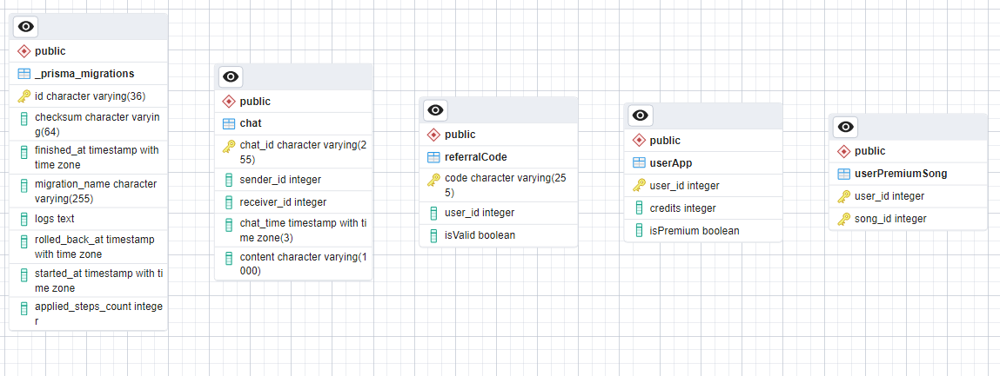

# Spotyphie - REST Service

> Disusun untuk memenuhi Tugas Milestone 2 - SOAP & RestFUL SPA Web Service - IF3110 Pengembangan Aplikasi Berbasis Web

## Daftar Isi

-   [Deskripsi _Web Service_](#deskripsi-web-service)
-   [Struktur Program](#struktur-program)
-   [Daftar _Requirement_](#daftar-requirement)
-   [Daftar _Fitur_](#daftar-fitur)
-   [Cara Instalasi](#cara-instalasi)
-   [Cara Menjalankan _Server_](#cara-menjalankan-server)
-   [Endpoint API](#endpoint-api)
-   [Entity Relationship Diagram](#entity-relationship-diagram)
-   [Pembagian Tugas](#pembagian-tugas)

## Deskripsi _Web Service_

**Spotyphie** REST-service merupakan _implementasi service back-end_ aplikasi berbasis web untuk mendengarkan musik dan melakukan _premium subscription_. Selain itu, pada sisi REST ditambahkan fitur saldo beserta transfer saldo antar pengguna yang digunakan untuk membeli lagu beserta melakukan _premium subscription_. Pengguna yang menggunakan spotyphie-premium dapat menikmati fitur-fitur yang ditawarkan _service_ ini. Service ini juga dapat dilakukan operasi khusus oleh user berstatus admin pada sisi _client_. 

## Struktur Program

```
./
├───.idea
│   ├───artifacts
│   └───libraries
├───assets
├───db
├───src
│   ├───DBSession
│   ├───jar
│   │   ├───artifacts
│   │   │   └───spotyphie_soap_jar
│   │   └───production
│   │       └───spotyphie-soap
│   │           ├───DBSession
│   │           ├───localhost
│   │           │   └───_8080
│   │           │       └───premiumservice
│   │           ├───Logging
│   │           ├───META-INF
│   │           ├───PremiumSong
│   │           └───PremiumUser
│   ├───localhost
│   │   └───_8080
│   │       └───premiumservice
│   ├───Logging
│   ├───META-INF
│   ├───PremiumSong
│   └───PremiumUser
└───target
    └───generated-sources
        └───annotations
```

## Daftar _Requirement_
1. Docker desktop

## Daftar _Fitur_

1. Autentikasi
2. Subscription
3. Chat
3. Referral Code
4. Premium Song Search
5. Credits/Saldo
6. Transfer Saldo
7. Premium Song Buy
8. Login & Register

## Cara Instalasi

1. Lakukan pengunduhan _repository_ ini dengan menggunakan perintah `git clone https://gitlab.informatika.org/if3110-2023-02-23/spotyphie-rest` pada terminal komputer Anda.
2. Pastikan komputer Anda telah menginstalasi dan menjalankan aplikasi Docker.
3. Lakukan pembuatan _image_ Docker yang akan digunakan oleh aplikasi ini dengan menjalankan perintah `docker .` pada terminal _directory_ aplikasi web.
4. Buatlah sebuah file `.env` yang bersesuaian dengan penggunaan (contoh file tersebut dapat dilihat pada `.env.example`).

## Cara Menjalankan _Server_

0. **Pastikan Spotyphie _monolith service_ telah berjalan**
1. Anda dapat menjalankan program ini dengan menjalankan perintah `docker-compose up --build -d` pada terminal _directory_ REST Service untuk pertama kali (untuk kedua kali cukup hanya dengan perintah `docker-compose up -d`).
2. REST Service berjalan pada pada URL `http://localhost:{SPOTYPHIE_REST_PORT}/`.
3. **Untuk menikmati fitur REST service, pastikan seluruh service Spotyphie Premium berjalan**
3. REST Service dapat dihentikan dengan menjalankan perintah perintah `docker-compose down` pada terminal _directory_ REST Service.

## Endpoint API
1. restUrl = `http://localhost:${import.meta.env.VITE_SPOTYPHIE_REST_PORT_HOST}`

## _Entity Relationship Diagram (ERD)_



## Pembagian Tugas

### Major Feature

|feature|13521125|13521131|13521172|
|-------|--------|--------|--------|
|Service Implementation||||
|Database postGRESQL||:heavy_check_mark:||
|JWA Token Authentication||:heavy_check_mark:||
|Chat Feature ||:heavy_check_mark:||
|Login & Register Feature||:heavy_check_mark:||
|Referral Code Feature||:heavy_check_mark:||
|Credits (saldo) Feature||:heavy_check_mark:||
|Premium Subscription Feature|||:heavy_check_mark:|
|Docker||:heavy_check_mark:|:heavy_check_mark:|

### Extras

|feature|13521125|13521131|13521172|
|-------|--------|--------|--------|
|Project Config|:heavy_check_mark:|:heavy_check_mark:|:heavy_check_mark:|
|Vite.js|||:heavy_check_mark:|
|prisma ORM||:heavy_check_mark:||


